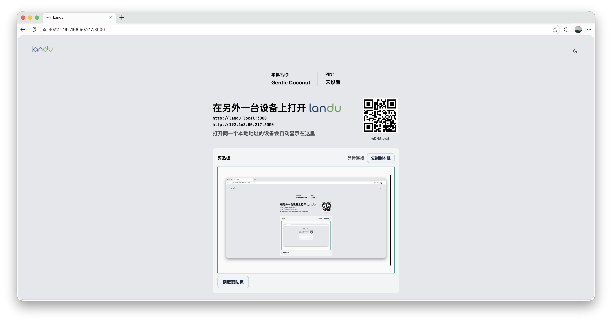
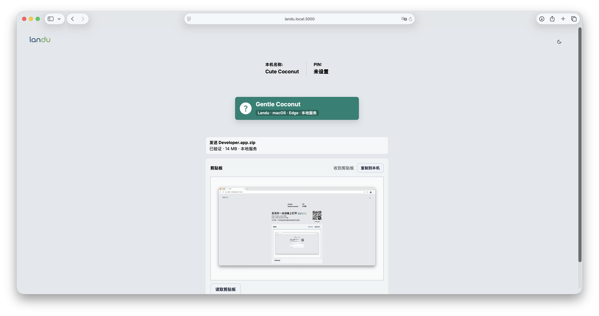

<p align="center">
  
</p>

<h1 align="center">Landu（岚渡）</h1>

<p align="center">
  局域网内使用的浏览器传输工具。自动发现设备，同步剪贴板，发送文件，不依赖外部网络。
</p>

<p align="center">
  
  
</p>

## 功能

- 本地发现：Node 服务维护局域网内的设备列表和 WebRTC 信令。
- mDNS 地址：默认提供 `landu.local`，同时显示局域网 IP 地址和二维码。
- PIN 隔离：设置相同 PIN 的设备才会互相发现；留空表示不使用 PIN。
- 文件发送：点击设备后选择文件，优先使用 WebRTC DataChannel，失败时回退到本地服务转发。
- 进度与校验：发送时显示进度条，接收端校验文件大小、分片顺序和分片校验值。
- 剪贴板同步：支持纯文本、富文本 HTML，以及内联图片剪贴板同步。
- 文件粘贴：粘贴非图片文件时会按文件传输发送。
- 主题切换：支持浅色和深色模式。

<table>
  <tr>
    <td width="50%" align="center">
      
    </td>
    <td width="50%" align="center">
      
    </td>
  </tr>
  <tr>
    <td align="center">剪贴板同步</td>
    <td align="center">文件发送</td>
  </tr>
</table>

## 快速开始

```bash
npm install
npm start
```

默认监听 `http://localhost:3000`。启动后终端会输出可访问地址，例如：

```text
http://localhost:3000
http://landu.local:3000
http://192.168.x.x:3000
```

同一局域网设备打开 `landu.local` 或 IP 地址即可进入同一个页面。

## 端口配置

```bash
PORT=8080 npm start
node index.js --port 8080
node index.js -p 8080
```

如果端口配置为 `80`，页面展示的地址会省略端口，例如 `http://landu.local`。

## PM2 部署

PM2 可以把 Landu 作为后台进程运行，并在系统启动后自动恢复。

### Linux

在项目目录中执行：

```bash
npm install
npm install -g pm2
pm2 start index.js --name landu -- --port 3000
pm2 save
pm2 startup systemd
```

`pm2 startup systemd` 会输出一条带 `sudo` 的命令，复制并执行它。执行完成后再运行一次：

```bash
pm2 save
```

常用命令：

```bash
pm2 status
pm2 logs landu
pm2 restart landu
pm2 delete landu
pm2 unstartup systemd
```

### Windows

用管理员权限打开 PowerShell，在项目目录中执行：

```powershell
npm install
npm install -g pm2 pm2-windows-startup
pm2 start index.js --name landu -- --port 3000
pm2 save
pm2-startup install
```

常用命令：

```powershell
pm2 status
pm2 logs landu
pm2 restart landu
pm2 delete landu
pm2-startup uninstall
```

需要换端口时，删除旧进程后用新端口重新启动：

```bash
pm2 delete landu
pm2 start index.js --name landu -- --port 8080
pm2 save
```

## 剪贴板限制

浏览器只允许在安全上下文里主动读取系统剪贴板。`http://landu.local:3000` 在 Edge、Chrome 等浏览器里通常会被视为非安全上下文，因此“读取剪贴板”按钮可能不可用；手动粘贴到剪贴板卡片仍可同步富文本和图片。

要让按钮也能主动读取富文本和图片，需要使用本地 HTTPS，例如 `https://landu.local:3000` 并信任证书。

## 测试

```bash
npm test
```

## 许可证

[MIT](LICENSE)

## 实现说明

- HTTP 静态服务和 API 使用 Express。
- 设备发现和转发使用本机 WebSocket 服务。
- `landu.local` 解析由本机 mDNS 响应提供。
- 地址二维码由本地 `/api/qr` 生成。
- 文件优先走 WebRTC；本地服务只作为兜底转发。
